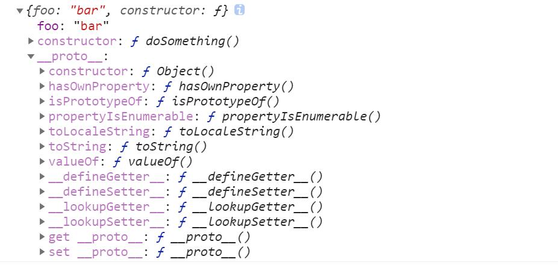
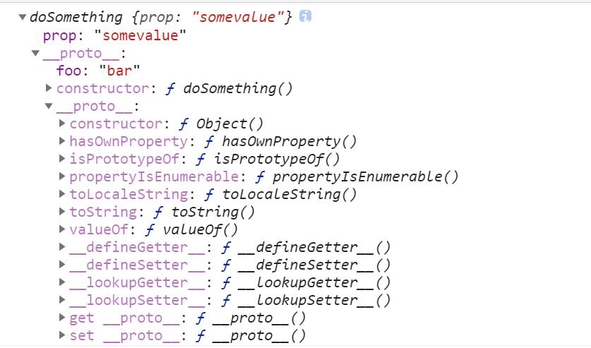

# 面向对象的JS

## 面向对象的程序

OOP:Object-oriented programing,什么是面向对象的程序

+ #### 基本思想

  + 在程序中，通过使用对象去构建现实世界的模型，
  + 把原本很难或不可能被使用的功能简单化并提供出来，以供访问

+ #### 对象

  + 对象包含相关数据和代码
    + 这些数据和代码用于表示构建的模型是什么样子
    + 数据和代码还表示模型拥有什么功能
  + 对象结构
    + 对象包（object package）或者叫命名空间namespace
    + 对象包封装对象的数据和函数
    + ——————
    + 这种对象结构使数据的组织和访问更容易
    + 可以作为数据存储体（data stores)，用于网络运输数据

+ #### 对象模板(和语言无关)

  + 确定一个要描述的对象，如人person

    + ```
      class: person
      ```

  + 确定需要对象的那些信息，如只需要人的名字，年龄，性别等，

    基于需要信息添加到对象描述中

    + ```
      class:person {
      	age;
      	gender;
      	interests;
      }
      ```

  + 基于信息写一个简短的对象描述介绍，为对象添加一个自我介绍能力；

    并且要教会作为人基本的能力：打招呼

    + ```
      class:person {
          name[firstName, lastName]
      	age;
      	gender;
      	interests;
      	
      	Bio(){
      	   "[name] is [age] years old. They like[interests]"
      	}
      	Greeting(){
      		"Hi! I'm[name]."
      	}
      }
      ```

  + 如果有其他需求，可以新增一些属性和方法，对对象细化

  + **这种为了编程的目标而利用事物的一些重要特性把复杂的事务简单化的方式称为抽象**

  + 在一些面向对象语言中，使用类来描述一个对象

    + 类不是一个对象，而是一个定义对象特质的模板

+ #### 创建一个实例对象

  + 基于class（对象模板）能够创造出一些对象

    + 这些对象拥有class中的属性和方法

  + 基于person类，可以创建出许许多多真实的人

    + ```
      Object: person1 {
      	name:[bob, smith];
      	age:25;
      	gender:male;
      	interests:Music,Sporting;
      	
      	Bio{
      		"bob is 25 years old. He like Music and Sporting"
      	}
      	Greeting {
      		"hi i'm bob"
      	}
      }
      
      Object: person2 {
      	name:[Diana, Cope];
      	age:24;
      	gender:female;
      	interests:Music,Sporting;
      	
      	Bio{
      		"Diana is 24 years old. She like Music and Sporting"
      	}
      	Greeting {
      		"Hi ,i'm Diana"
      	}
      }
      
      ```

  + 这种创建的对象需要从类（对象模板）中实例化

    + **一个对象需要从类中创建出来，类的构造函数就会运行来创建这个实例**
    + 这种创建对象的过程称为**实例化——实例对象被类实例化**

+ #### 更为具体的对象模板

  + 人是一个比较宽泛的描述对象

  + 根据自己的分类标准确定描述一个被胞吞于人之下的更为具体的对象

    + 例如，根据职业，我们想要描述老师，学生这样更具体的人
    + 根据地域，可以描述更为具体对象，如亚洲人，美洲人，非洲人等

  + OOP可以基于其他类创建新类（更为具体的之类）

    + 继承父类的数据和功能

    + 定义专用的特征

    + ```
      class:Teacher inherited Person {
      	super(); //继承父类所以属性和函数
      	
      	// 独有属性或函数
      	subject; //科目
      	school; //学校
      	
      	//重写方法
      	Greeting(){
      		super() + 'I am a teacher';
      	}
      	
      }
      
      class:Student inherited Person {
      	super(); //继承父类所以属性和函数
      	
      	// 独有属性或函数
      	grade; // 年级 
      	school; // 学校
      	
      	//重写方法
      	Greeting(){
      		super() + 'I am a student';
      	}
      	
      }
      ```

    + 这种多个对象拥有实现共同方法的能力称为**多态**

      + 例如老师类和学术类对其继承的共同方法Greeting（）的实现能力

  + 定义好子类后，可以实例化类——创建对象

## JS的构建函数和对象

#### JS没有用于创建class类的声明

JavaScript用一种称为**构建函数**的特殊函数来定义对象和它们的特征

+ #### 构建函数

  + 构建函数在不知道需要多少对象实例时很有用
  + 构建函数提供创建对象的有效方法
  + 构建函数将对象的数据和特征函数按需联结至相应对象
  + **构建函数创建新实例特征不是全盘复制，通过原形链链接过去**
  + 构建函数创建的并非真正实例，JS对象间的共享机制与其他语言不同
    + 经典面向对象语言会让OOP变的非常复杂
    + JS找到了在不变复杂情况下利用面向对象的优点的方法

+ #### 创建类

  + 通过普通函数定义一个类，如人

    + ```js
      function createNewPerson(name) {
      	var obj = {};
      	obj.name = name;
      	obj.greeting = function() {
      		alert('打招呼' + this.name);
      	}
      	return obj;
      }
      
      // 创建实例
      var salva  =createNewPerson('salva'); 
      salva.greeting();
      ```

    + 这个普通函数创建了一个新的字面量obj（空对象），

    + 对obj进行一些操作后，然后作为人对象实例返回

    + **对于所有普通的创建对象函数，都会新建一个空对象，最后返回这个空对象**

      + 这是不必要的
      + **因为我们的目标就是创建一个对象，没必要创建一个新的并返回它**
      + 使用构建函数省略这一相同代码，使得定义一个类更加整洁

  + 通过构建函数定义一个类，如人

    + ```js
      function Person(name) {
      	this,name = name;
          this.greeting = function() {
              alert('打招呼' + 'this.name');
          };
      }
      // 	创建实例
      var bob = new Person('bob');
      bob.greeting();
      ```

    + 只定义了对象的属性和方法

    + **使用this关键字，无论该对象的哪个实例被构造函数创建，**

      **name属性就是传递到构建函数形参的name值**

      + 因为this能够很好的知晓**上下文的变换**

    + 构建函数名称由大写字母开头，便于区分普通函数

+ #### 使用构造类创建对象

  + 构造对象语法

    + ```js
      var person1 = new Person('Bob');
      var person2 = new Person('Sarah');
      ```

  + 被创建对象包含如下值

    + ```js
      {
          name : 'Bob';
          greeting : function() {
              alert('Hi i\'m' + this.name + '.')
          }
      }
      
      ```

+ #### 创建一个完整的构造类（构造函数）
  + 添加构造函数的参数以添加类属性

  + 添加构造类的方法

    ```js
    function Person(first, last, age, gender, interests) {
      this.name = {
        'first': first,
        'last': last
      };
      this.age = age;
      this.gender = gender;
      this.interests = interests;
      this.bio = function() {
        alert(this.name.first + ' ' + this.name.last + ' is ' + this.age + ' years old. He likes ' + this.interests[0] + ' and ' + this.interests[1] + '.');
      };
      this.greeting = function() {
        alert('Hi! I\'m ' + this.name.first + '.');
      };
    };
    ```

## 创建对象的其他方式

除了声明一个对象（obj = {}) 和构造函数，还有其他方法可以创建对象

+ #### Object()构造函数

  + 一般对象的构造函数

  + 创建一个空对象

  + **像使用声明对象方法创建的对象一样使用这个对象**

    + 例如：

      ```JS
      var person = new Object();
      // 句点法
      person.name = 'Chris';
      // 括号法
      person['age'] = 35;
      ```

  + 在Object()中填入像字面量中声明的那样的属性和方法

    + ```js
      var person = new Object({
      	name:'Chris',
      	age:38,
      	greeting : function(){
      		code to run;
      	}
      });
      ```

+ #### 使用create()方法

  + Object的内嵌方法，用于基于**现有对象**创建新对象

  + ```js
    var person2 = Object.create(person);
    person2.name; // Chris
    ```

  + 允许创建新的对象无需定义构造函数

  + 需要的浏览器版本靠前

# 对象原型

**经典的OOP中类的具有继承机制，是通过子类对父类的直接继承获得父类的属性和方法**

**而OOJS中的对象继承其他对象的功能和OOP不同，它依靠原型这种机制**

## 基于原型的语言

+ #### 基于原型的语言（prototype-based language)

  + JavaScript被称为基于原型的语言

  + 每个对象拥有一个**原型对象**

  + 对象以其原型为模板、从原型继承方法和属性。

  + 原型对象也可能拥有原型，并从中继承方法和属性

  + 一层一层，这种关系被称为**prototype chain**原型链

    + 这种关系解释了一个对象为什么会有定义在其他对象中的属性和方法

  + 准确的说**这些属性和方法定义在Object的构造器函数(constructor function)之上**

    **的*prototype*属性上** 

+ #### 传统OOP与OOJS

  + OOP
    + 首先定义‘类’，此后创建对象实例
    + 类中所有属性和方法都被复制到实例中
  + OOJS
    + 在对象实例和它的构造器之间建立一个链接
    + 这个链接称为\__proto__属性（已被弃用）,是从构造函数的prototype属性派生的
    + 之后通过上溯原型链，在构造器中找到属性和方法
    + ——————————
    + 通过Object.getPrototypeOf(obj)可以获得对象原型（之前用\__proto__)

## 使用JavaScript中的原型

+ JS中，**函数可以有属性**

+ 每个函数都有一个特殊属性叫做**原型（prototype）**

+ 无论怎样声明函数，函数的原型属性是默认的

  + ```js
    var doSomething = function(){
        //give prototype a property
        this.doSomething.property.foo = 'bar';
    };
    console.log(doSomething.prototype);
    ```

    

+ 创建一个函数实例化对象，并给这个对象添加一个属性，可以查看

  **函数‘给了’这个实例化对象什么**

  ```js
  var doSomeInstancing = new doSomething();
  doSomeInstancing.prop = 'somevalue';
  console.log(doSomeInstancing);
  ```

  
  + 可以看到

    + **函数把原型属性（prototype)完全赋值给了实例对象的\__proto__属性**

    + 这样把原型属性完全赋值给实例对象的\__proto__属性的好处是

      + 如果把可以继承的一些通用属性和方法放在构造函数的原型属性中

        那么**构造函数的实例对象就可以通过在\__proto__属性查找想要的属性了**

      + 例如，如果访问doSomeInstancing的一个属性，如果没有这个属性，就会在

        doSomeInstancing的\__proto__属性中查找这个属性，也就是函数的原型属性

        如果doSomeInstancing的\_\_proto\_\_属性中有，那么这个在\__proto__属性中的

        就会被使用；否则，就会去查找\_\_proto\_\_属性中的\__proto__属性,也就是

        doSomething函数中的原型属性的\__proto__属性，而这个函数原型proptotype

        中的\__proto__其实是继承自Object.prototype.即

        **所有函数的原型属性的\__proto__就是window.Object.prototype**  而**window.Object.prototype**属性中再没有\__proto__属性,那么**原型链最**

        **上面的所有\__proto__属性都被找完了**，都不存在这个属性就返回undefined了

### 理解原型对象

+ 在使用构造函数构造类时
  + 创建一个对象实例
  + 在控制台中使用这个对象实例
  + 会发现person中除了有构造函数中定义的方法
  + 还有一些其他成员
    + 这些成员来自于Person的prototype属性
    + 而prototype属性中的\_\_proto\_\_又来自于Object函数中的prototype属性
+ 所以在使用person调用一些继承方法时
  + 这些方法继承自Person()构造器的原型对象的原型对象、即Object的prototype属性指向的对象
  + **原型链中的方法和属性没有被复制到对象，而是通过原型链访问最上层的\_\_proto\_\_属性中的方法和属性**
+ 可以使用\_\_proto\_\_属性访问对象的原型对象

### prototype属性

+ #### 继承的属性和方法是定义在原型属性中的

  + 该原型属性又称为子命名空间，即Object.prototype是一个子命名空间
  + 原型属性的值是一个对象，被原型链下游的对象继承的属性和方法都存储其中

+ #### 构造器本身就是一个对象类型

  + 构造器有自己的原型，即prototype
  + 只不过因为其是函数，原型被定义为prototype而不是\__proto__

+ #### JS中到处是原型链继承的例子

  + 例如可以通过String，Number等构造函数中的全局对象的原型中找到方法和属性
  + 当创建一个字符串时，它的原型对象（\__proto__）就是String函数中的prototype属性
  + 而这个原型属性中定义了大量的方法和属性供给新建字符串使用

### create()

Object.create()方法创建新的对象实例

+ 这个方法实际做法是从指定原型对象创建新的对象

+ ```js
  var person2 = Object.create(person1);
  person2.__proto__; //结果为person1
  ```

+ 改变person2中的name或者其他属性，person2也会改变

### constructor属性

每个实例对象都从原型继承了一个constructor属性，

##### 该属性指向了用于构造此实例对象的构造函数。

+ 可以通过constructor属性来构造一个对象

  ```js
  var person3 = new person1.constructor(
      'Karen', 'Stephenson', 26, 'female', 
      [
          'playing drums', 'mountain climbing'
      ]
  );
  ```

+ 因为这个属性的值本身就指向构造函数

+ 可以退通过该构造器知晓构造函数的名称

  ```
  person1.constructor.name; //Person
  ```

  

### 修改原型

+ 可以通过Person.prototype.new 来为原型添加方法

  ```js
  Person.prototype.farewell = function() {
    alert(this.name.first + ' has left the building. Bye for now!');
  }
  ```

+ 这样，通过构造函数创建的对象，都会拥有这个在原型中的方法

+ ##### 整条继承链动态地更新了，任何由此构造器创建的对象实例都自动获得了这个方法

+ 对于先创建的对象实例，如果构造器在原型中添加了新方法，旧对象实例也可以用！

  + ##### 这种继承模型下，上游对象的方法不会复制到下游的对象实例中；

  + ##### 下游对象本身虽然没有定义这些方法，但浏览器会通过上溯原型链、从上游对象中找到它们。

  + 这种继承模型提供了一个强大而可扩展的功能系统。

+ 一般不在原型中定义属性：

  + 属性赋值如果是静态的，那么这将是每个实例的共有属性
  + 对于person类，其姓名，年龄，性别大都是不一致的，所以不能定义在原型中
  + 属性定义在构造器类内最好

+ 对象定义模式

  + 在构造器（函数体）中定义属性
  + 在 `prototype` 属性上定义方法。
  + 如此，构造器只包含属性定义，而方法则分装在不同的代码块，代码更具可读性。