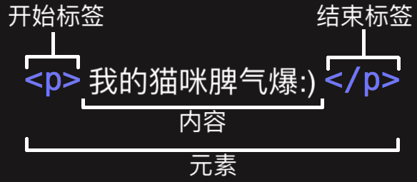

# Web 入门学习

## 基础软件

#### 1.文本编辑器

[Visual Studio Code](https://code.visualstudio.com/)

[WebStorm](https://www.jetbrains.com/webstorm/)

#### 2.web浏览器

[Chrome](https://www.google.com/chrome/browser/)

#### 3.版本控制系统

[Git](http://git-scm.com/)

#### 4. 安装本地Web服务器

+ 双击本地html文件
  
  +  `file://` 开头
+ 在 GitHub 上托管的示例（或其他远程服务器上的示例）
  
+ Web 地址会以 `http://` 或 `https://` 开头
  
+ [运行一个简单的本地服务器](https://developer.mozilla.org/zh-CN/docs/Learn/Common_questions/set_up_a_local_testing_server#%E8%BF%90%E8%A1%8C%E4%B8%80%E4%B8%AA%E7%AE%80%E5%8D%95%E7%9A%84%E6%9C%AC%E5%9C%B0_HTTP_%E6%9C%8D%E5%8A%A1%E5%99%A8)
  + 配置Python

  + ```shell
    python -V # 查看版本
    cd 输入你想要进入的目录
    ```

  + ```shell
    ＃如果上面返回的Python版本是3.X 
    python -m http.server 
    ＃如果上面返回的Python版本是2.X 
    python -m SimpleHTTPServer
    ```

  + localhost:8000：会看到列出的目录的内容 - 点击你想运行的HTML文件
  + 如果您已经在端口8000上运行了某些东西，则可以通过运行server命令，然后选择另一个端口号（例如`python -m http.server 7800` （Python 3.x））


## 设计

## 文件处理

### 基本结构

**`index.html`** :使用python.http.server模块打开文件夹后，文件夹中首先默认打开这个html文件（否则显示目录）

**`images`**

**`styles`**

**`scripts`**

# HTML基础

### html是定义内容结构的*标记语言*

+ 组成：元素
+ 元素：标签 + 内容



+ 元素标签：可以有属性
  + class：属性名
  + “ ”：属性值
+ 元素嵌套：将一个元素置于其他元素之中
+ 空元素：不包含任何内容的元素

### 基本组成


```html
<!DOCTYPE html> <!--文档类型-->
<html> <!--整个页面的内容，也称作根元素 -->
    <head> <!--页面声明、描述-->
        <meta charset="utf-8"> <!--字符集-->
        <title></title> <!--标题-->
        <!--搜索关键字、CSS 样式表等-->
    </head>
    <body>
        <h1>
            主标题：HTML 包括六个级别的标题
        </h1>
        <p>
            段落
        </p>
        <ul>
            <li>无序列表</li>
            <li>无序列表</li>   
		</ul>
        <ol>
            <li>有序列表</li>
            <li>有序列表</li>

        </ol>
    	<a href="">链接</a>
	</body>
</html>
</!doctype>
```


# CSS基础

### 层叠样式表：为网页添加样式的代码

#### CSS规则集

+ 组成：选择器 + { + 声明 + }
+ 选择器：html中的元素等(可以多选，用','隔开)
+ 声明：属性 ： 属性值;


+ 选择器类型
  + 元素选择器，如 p 选择 <p>
  + ID选择器，如 #idname 选择 <p id = "idname">或<a id = "idname"> （id和元素具有一一映射性质）
  + 类选择器，如 .classname 选择 <p class = "classname">h和<a class ="classname"> (类可以有多个实例)
  + 属性选择器， 如 img[src] 选择 &lt;img src  = "image.png"&gt;
  + 伪类选择器，特定状态下的特定元素（比如鼠标指针悬停）a:hover 仅在鼠标指针悬停在链接上时 选择 <a>

+ 属性
  + `padding`：即内边距，围绕着内容（比如段落）的空间。
    + `padding: 0 20px 20px 20px;` —— 我们给内边距设置了四个值来让内容四周产生一点空间。这一次我们不设置上方的内边距，设置右边，下方，左边的内边距为20像素。值以上、右、下、左的顺序排列。
  + `border`：即边框，紧接着内边距的线。
    + `border: 5px solid black;` —— 直接为 body 设置 5 像素的黑色实线边框。
  + `margin`：即外边距，围绕元素外部的空间。
    + `margin: 0 auto;`—— 为 margin 或 padding 等属性设置两个值时，第一个值代表元素的上方和下方（在这个例子中设置为 0），而第二个值代表左边和右边（在这里，auto 是一个特殊的值，意思是水平方向上左右对称）。


# JavaScripts基础

### JavaScript 是一门编程语言，可为网站添加交互功能

（例如：游戏、动态样式、动画以及在按下按钮或收到表单数据时做出的响应等）。

+ 变量(Variable)

  + ```javascript
    let myVariable;
    var myVariable2;
    // 使用let更好
    myVariable = '123';//字符串
    myVariable = 123;//数字
    myVariable = true;//布尔值
    myVariable = ['123',123,true]; //数组	
    myVariable = document.querySelector('h1');//对象
    ```

+ 运算符

  + 等于 ===
  + 不等于 !==
  + 取非 !

+ 函数

  + 如`alert('hello');`内置函数

  + [`prompt()`](https://developer.mozilla.org/zh-CN/docs/Web/API/Window.prompt) 函数

    + 与 `alert()` 类似会弹出一个对话框。但是这里需要用户输入数据，并在确定后将数据存储在定义好的变量里。

    + ```javascript
      let myName = prompt('请输入你的名字。');
      ```

      

  + 函数定义：

    ```javascript
    function multiply(num1, num2) {
    	let result = num1 * num2;
    	return result;
    }
    ```

+ 事件

  + 点击事件

    + ```javascript
      document.querySelector('html').onclick = function() {
          alert('别戳我，我怕疼。');
      }
      ```

    + 把一个匿名函数（就是没有命名的函数，这里的匿名函数包含单击鼠标时要运行的代码）赋值给了 `html` 的 `onclick` 属性

    