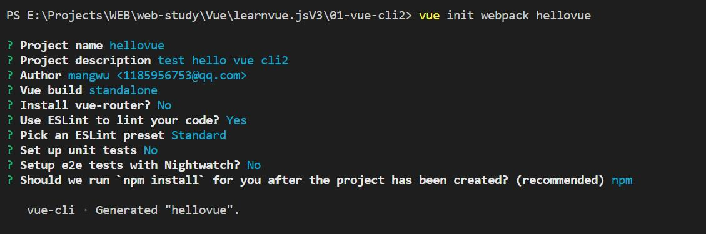

# 脚手架

+ 简单Vue demo 不需要Vue Cli
+ 开发大型项目
  + 需要使用Vue CLI
  + 如果不使用脚手架，需要考虑
    + 代码结构
    + 项目结构
    + 部署
    + 热加载
    + 代码单元测试
  + 上述的都需要webpack进行配置
+ CLI =>Command-Line-Interface 翻译为命令行命令，俗称脚手架
+ Vue-CLI脚手架工具完成基本的Vue开发环境和webpack配置
  + 搭建项目环境和配置

## 安装

依赖项

+ node

```shell
node -v 
// 8.9以上
```

+ webpack

依赖于webpack 引用脚手架使用会进行webpack配置

```shell
npm install webpack -g
```

+ Vue-cli

```
npm install -g @vue/cli
```

一般情况下全局安装

+ Vue CLI 的包名称由 `vue-cli` 改成了 `@vue/cli`。 如果你已经全局安装了旧版本的 `vue-cli` (1.x 或 2.x)，你需要先通过 `npm uninstall vue-cli -g` 或 `yarn global remove vue-cli` 卸载它。

+ 查看版本

  ```shell
  vue --version
  ```

  @vue/cli 4.5.12

### 拉取旧版本模板

2.x模板

[旧版本](https://cli.vuejs.org/zh/guide/creating-a-project.html#%E6%8B%89%E5%8F%96-2-x-%E6%A8%A1%E6%9D%BF-%E6%97%A7%E7%89%88%E6%9C%AC)

使用脚手架2时的模板

这样做的好处

+ 既可以使用脚手架2也可以使用脚手架4

#### 脚手架cli2初始化项目

```shell
vue init webpack project
```

+ Projectname : 项目名称 默认为project
+ Project description: 项目描述 默认为A vue.js project
+ Author： 项目作者（authorname authoremail) 默认读取git的全局作者设置
  + .gitconfig文件在windows用户下
  + 一般有包含很多git的配置
  + 可以在里面使用别名alias
+ Vue build：vue的运行方式，两种，默认选中Runtime + complier  ,另一个为Runtime-only 
  + 大部分选中第一个
  + 但是第二个性能更好，体积更小
+ Install vue-router: vue全家桶一部分，配置前端路由，默认安装，可以不按照查看原始vue-cli2结构
+ ESlint： js规范 如果JS不规范就会报错
+ Pick ESLint preset： 选择一个es规范，标准（规范），airbnb（一个公司规范），none（配置自己的）
+ Set up unit tests: 单元测试 ，国内一般测试很少
+ Setup e2e tests with Nightwatch: end to end 端到端测试 使用Nightwatch（依赖selenium)框架进行自动化测试
+ 项目依赖管理：npm 或者 yarn 或者自己管理依赖（一般选中npm)
+ 

#### 脚手架cli3/4初始化项目

```
vue create project
```

