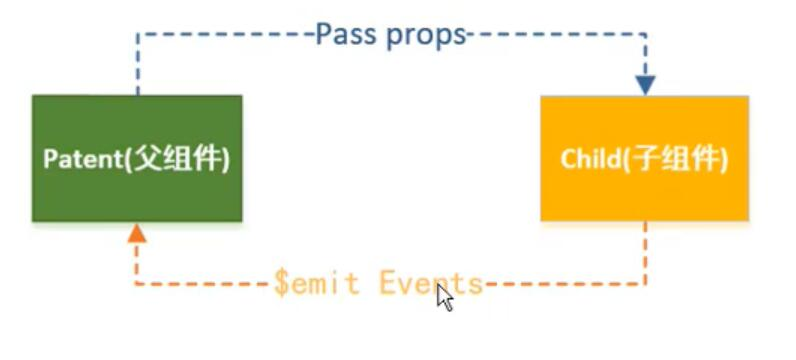

# 组件中的data

### 组件不能访问Vue实例数据

+ Vue实例中的数据只能供实例和其挂载的元素使用
+ Vue组件应该有自己保存数据的地方
+ Vue实例应该是所有Vue组件的Root

### 组件内部的data

+ 组件内部的data不能是对象类型
+ data应该是一个方法，且返回一个实例

### 组件也可以有methods

+ 组件的原型就是Vue
+ 它也有生命周期

### 父子组件传递信息

+ 父组件传递信息给子组件
  + props
    + 自定义模板元素属性
    + 
+ 子组件传递信息给父组件
  + 自定义事件
    + emit
  + 