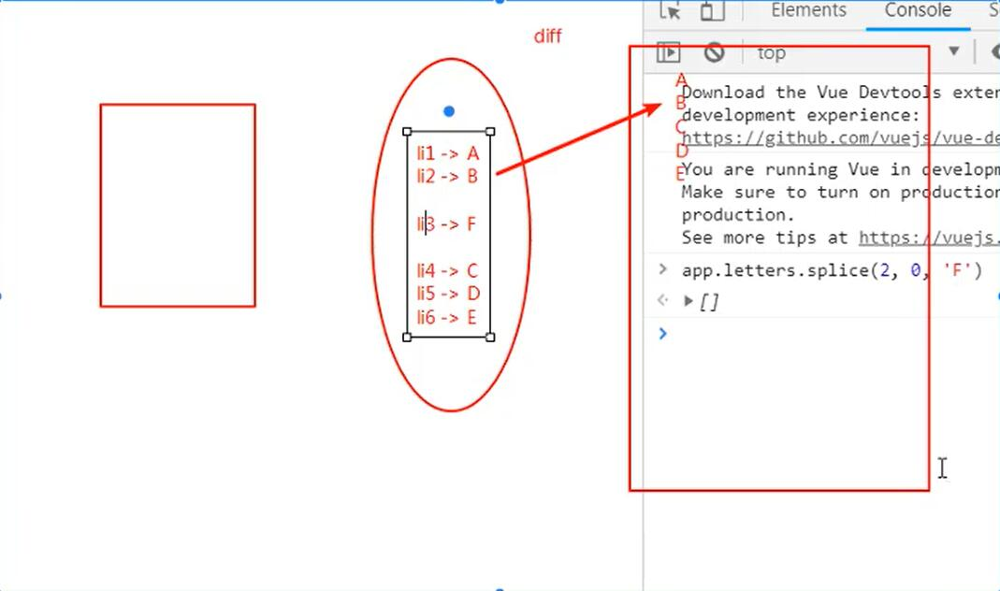

# v-for

+ 遍历数组

  + (value, index) in items

+ 遍历对象

  + (value, key, index) in obj

+ 处理splice方法时的渲染过程

  
  + 插入在li3处插入F
  + 虚拟DOM替换li3为F
  + 将后续的CD和li4 li5绑定 
  + 创建一个新的li6绑定E

+ 这种方式效率比较低，使用key将li元素和值进行绑定，插入新值时不需要改动其他元素