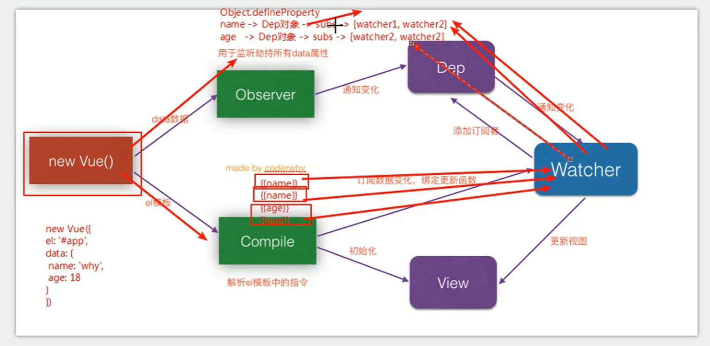

# Vue的响应式原理

不要认为vue的响应式原理是理所当然的（数据和DOM的动态更新在vue中是有其中的原理的）

### 响应式代码

```vue
<div id="app">{{message}}{{message}}{{message}}</div>
_______________________________
const app = new Vue({
     el: "#app",
     data: {
         message: "哈哈哈",
     },
 });
```

+ data中的数据发送改变时，界面自动刷新

### Vue实现的DOM内部响应原理（非vue2.x,vue3使用proxy)

1. `app.message`修改数据=>Vue内部如何监听message数据发生改变？

   + [`Object.defineProperty()`](https://developer.mozilla.org/zh-CN/docs/Web/JavaScript/Reference/Global_Objects/Object/defineProperty) =>直接在对象上定义一个新属性，或者修改一个对象的现有属性，并返回此对象

   +  可以通过这个返回的对象监听对象属性的改变(数据劫持)

   + ——————

   + ##### 监听对象属性原理：

     1. 在Vue的option传入data数据（一些对象属性，例如上面的`{message: '哈哈哈'}`)

     2. ```js
        Object.keys(obj).forEach(key => {
        	// 遍历对象的键，拿到key，获取每个值
        	let value = obj[key]
        	// 监听每个值的改变【重新定义obj({message:'哈哈哈'})】
            Object.defineProperty(obj, key,{
                // 当改变data中的属性值如app.message='呵呵呵'，就会执行set
                set(newValue) {
                    // 在这里监听key的改变
                    code to watch key change
                    ……
                    // 通知使用该key的DOM进行改变
                    code to notifiy change
                    dep.notify()
                    ……
                    value = newValue
                },
                get() {
                    // 创建一个监听对象
                    const w1 = new Watcher('dom1')
                    // 获取 key 对应的值
                	return value   
                }
            })
            
        })
        ```

        

2. 当数据发生改变=>Vue是如何知道要通知那些那些DOM或text需要刷新？

   + 发布订阅者模式
     + Vue解析HTML文档中使用了data中属性的地方
     + 为每个使用了key的取名
     + 让这些DOM或者text订阅上述的属性改变

   + ————

   + 发布订阅模式实现思路

     ```js
     // Dependency 依赖 用于存储对属性（key）有依赖的东西 发布者
     class Dep {
     	constructor() {
             // 订阅数组，记录订阅key的DOM或text
             this.subscribes = []
         }   
         addSub(wather) {
             //加入一个sub的人
             this.subs.push(watcher)
         }
     }
     // Watcher 用于记录DOM和text的代号对象
     class Watcher {
         constructor(name) {
             this.name = name;
         }
         update() {
             this.name update
         }
         notify() {
             this.subs.forEach(item => {
                 item.ipdate()
             })
         }
     }
     
     const dep = new Dep()
     
     cosnt w1 = new Watcher('dom')
     dep.addSub(w1)
     ```

   + 