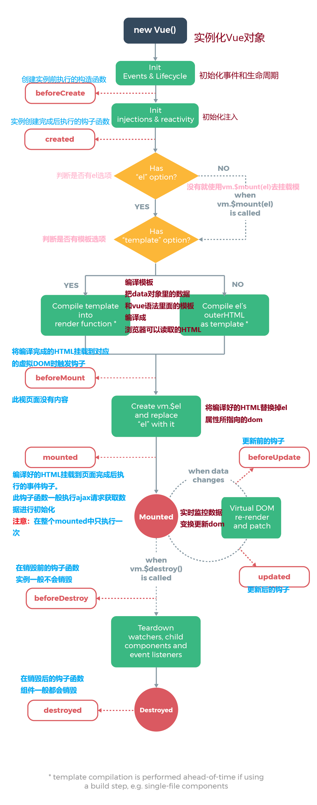

# 传入Vue的参数

+ [选项/生命周期钩子](https://cn.vuejs.org/v2/api/#%E9%80%89%E9%A1%B9-%E7%94%9F%E5%91%BD%E5%91%A8%E6%9C%9F%E9%92%A9%E5%AD%90)
+ el:
  + 类型：string | HTMLElement
  + el: #app
  + el: document.querySelector('#app')
  + 作用：决定Vue实例管理的DOM
+ data:
  + 类型： ObJect | Function(组件中data必须是函数)
  + 作用：Vue实例对应的数据对象
+ methods：
  + 类型：{[key:string] : Function,}
    + 方法：method，定义在对象或类里面，和实例对象挂钩
    + 函数：function，全局定义

## Vue 的生命周期

+ 生命周期：事物从诞生到消亡的整个过程
+ Vue的生命周期：
  + new Vue()，创建，诞生
  + 实例内部会有一系列的事情去做
+ 理解生命周期的意义：
  + 不同的生命阶段会调用不同的函数
  + 例如在创建new Vue()时，添加
    + created: function() {}
    + mounted:function() {}
  + callHook()函数回调在不同生命周期中的做不同的事情
+ 生命周期
+ 根据项目需求使用回调钩子