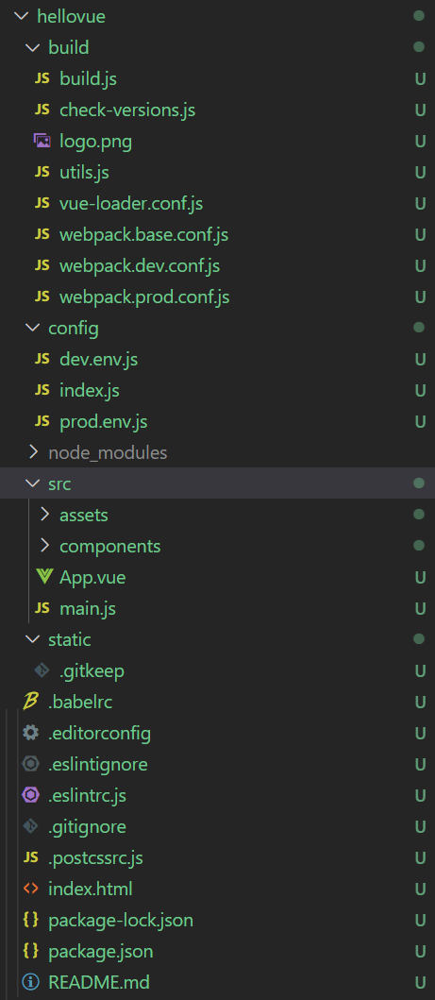
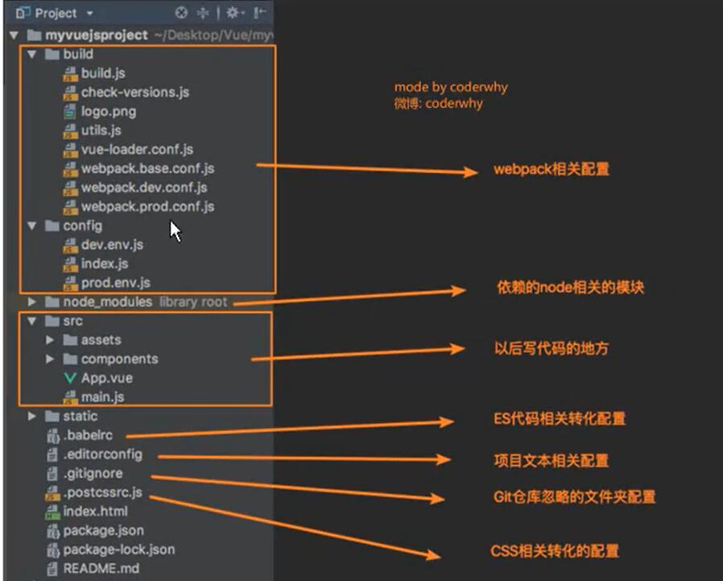

# vue-cli2项目结构

## 项目目录

- 


## 解读目录结构

### 1. 查看package.json

```js
"scripts": {
    "dev": "webpack-dev-server --inline --progress --config build/webpack.dev.conf.js",
    "start": "npm run dev",
    "lint": "eslint --ext .js,.vue src",
    "build": "node build/build.js"
 },
```

+ #### npm run build 打包项目

  + node build/build.js

    + 用node执行JS文件

    + build.js做了很多事情

    + ```js
      const webpackConfig = require('./webpack.prod.conf')
      ……
      rm(path.join(config.build.assetsRoot, config.build.assetsSubDirectory), err => {
        if (err) throw err
        webpack(webpackConfig, (err, stats) => {}
      }
      ```

    + rm 删除之前dist的打包

    + 查找webpack相关配置进行打包

    + ##### 使用了build/webpack.prod.conf.js

      + ```js
        const merge = require('webpack-merge')
        ……
        const webpackConfig = merge(baseWebpackConfig, {
        
        })
        ```

      + 这就使用了基础相关配置了webpack.base.conf.js
      + 其中包含了大量的插件

  + ##### node

    + 以前执行js代码必须有**浏览器**

      + js执行->生成字节码
      + 字节码->浏览器解析
      + 现在浏览器都是直接生成二机制流

    + 现在node为js代码执行提供了运行环境

      + js能在node环境中运行

      + ##### 服务器安装node环境，那么就可以使用js编写后端了！

      + node是JS不在浏览器运行而在服务器运行的底层支撑，可以直接使用node执行js文件

    + node使用C++ 开发

    + node核心是V8引擎

      + V8引擎是谷歌开发的，也是C++编写

      + Chrome使用V8引擎 --现在其他浏览器也使用

      + ##### V8引擎使得JS执行不需要生成字节码

      + js执行--通过V8-->二机制代码

+ #### npm run dev 开发模式运行

  + webpack-dev-server --inline --progress --config build/webpack.dev.conf.js
    + 指定配置webpack.dev.conf.js
      + 和webpack.prod.conf.js配置类似
      + 先合并webpack.base.conf.js
      + 再使用独自的插件和运行服务
    + --inline :实时更新

### 2. config 配置相关

+ dev.env.js
  + 开发配置
+ index.js 
  + 包含dev 和 build 在其中定义变量
    + 定义变量
    + 定义端口
    + 是否自动打开浏览器
+ prod.env.js
  + 生成配置

+ #### build和config文件夹都是webpack相关配置


### 3. node_modules

+ 依赖模块

```json
"dependencies": {
    "vue": "^2.5.2"
  },
  "devDependencies": {
    "autoprefixer": "^7.1.2",
    "babel-core": "^6.22.1",
	……
    "webpack-dev-server": "^2.9.1",
    "webpack-merge": "^4.1.0"
  },
```

+ 开发时依赖很多
+ 生成模式版本使用vue（cli2默认用2.5.2)

### 4. src文件夹

+ 开发时写入代码
+ 会有一些资源，根据大小打包

### 5. static

+ 存放静态资源
+ 会被原封不动打包到dist



### 6. babelrc

配置babel-preset-env后会要求使用.babelrc对babel环境进行配置

```json
{
  "presets": [
    ["env", {
      "modules": false,
      "targets": {
        "browsers": ["> 1%", "last 2 versions", "not ie <= 8"]
      }
    }],
    "stage-2"
  ],
  "plugins": ["transform-vue-jsx", "transform-runtime"]
}

```

+ 作用把ES6（或者更高版本）转化成ES5
+ 浏览器配置：
  + 市场份额大于1%
  + 适配最后两个版本
  + ie8以下不考虑
+ 阶段配置
  + stage-2 :转化代码只正对ES的某个阶段
+ 插件
  + babel依赖的一些插件


### 7. .editorconfig

#### 对代码进行统一

+ root = true 检查root下的文件

+ 编码
+ end_of_line = lf 换行
+ indent_size = 2 间隔
+ insert_final_newline = true 在每个代码文件自动加入一个空行
+ trim_trailing_whitespace = true  清楚两边的无用空格


### 8. eslintignore

#### 代码规范忽略

+ /build/
+ /config/
+ /dist/
+ /*.js 当前项目下忽略

### 9. .eslintrc.js

#### 代码规范检测配置

### 10. .postcssrc.js

#### CSS转化配置相关

### 11. index.html

模板代码，打包时根据这个模板创建index.html到dist

### 12. package-lock.json

+ package.json中依赖的版本都是简略版本

  + ```json
    "copy-webpack-plugin": "^4.0.1",
    "css-loader": "^0.28.0",
    "eslint": "~4.15.0",
    ```

  + ^最后一个版本号可变且大于这个版本

  + ~最后两个都可以变且大于这个版本

+ package-lock.json记录真实安装版本（锁版本用)

### 13. README.md

+ 项目相关东西

