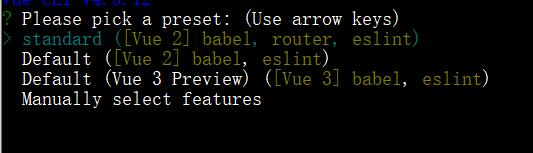

# 改变

与vue-cli2相比

+ 基于webpack4
+ 移除配置目录，build和config不见
+ 提供vue ui
+ 移除static，增加public 将index.html加入到public中
+ 默认创建.git文件夹用于版本控制

# 创建项目

```shell
vue create projectname
```

1. please pick a preset 选中配置
   1. 
   2. 选择手动查看配置
2. 手动配置 按空格是选中和取消
   1. 
   2. 取消选中Linter =》对代码进行规范的东西
   3. Unit testing和E2E testing一般都不选
   4. TypeScript是JS超集
   5. Progressive Web App Support: 先进webapp
      + 缓存
      + 推送通知
   6. 选择Babel
3. 选择vue版本，现在已经有3.x版本，但是还是使用稳定的2.x版本
   1. 

4. 配置文件处理方式

   1. 
   2. In dedicated config files :某些配置文件在单独配置文件
   3. in package.json :放在package.json中

5. 是否将这次配置的项目作为一种模板可供选择

   1. 

   2. 可以保存一个试一试

6. 配置项目模板名称

   1. 

7. 选择包管理工具（npm 或者 yarn)
   + vue-cli4没有此项
8. 后续删除配置模板
   + 在users/admin中找到.vuerc，删除
   + rc后缀来源于Unix系统的前辈CTSS，它其中有个叫做“run command”的命令脚本功能。早期的Unix版本使用rc在操作系统启动脚本的文件名中，以尊重CTSS的成果。


### 项目结构


#### 1. node_modules

+ 项目依赖包

### 2. public

+ 代替static的静态文件

### 3. src

+ 源码

### 4. .browserslistrc

+ 浏览器兼容性配置
+ 市场份额大于1%
+ 最新的两个发行版本。
+ 通过last 2 versions 筛选的浏览器版本中，全球使用率低于0.5%并且官方申明不再维护或者事实上已经两年没有在更新的版本，不再兼容这些版本。

```
> 1%
last 2 versions
not dead
```

### 5.  babel.config.js

对babel的配置

### 6. package.json

```json
"devDependencies": {
    "@vue/cli-plugin-babel": "~4.5.0",
    "@vue/cli-service": "~4.5.0",
    "vue-template-compiler": "^2.6.11"
  }
```

+ 比较少
+ 通过@vue/cli-service间接管理很多包，显示的东西很少

### 7.  package-lock.json

安装的真实版本

### 8. README.md

项目文档

## 不同

删除了postcss.config.js，css转化相关的配置也被隐藏管理了

## 运行

```
"scripts": {
    "serve": "vue-cli-service serve",
    "build": "vue-cli-service build"
  },
```

```
npm run serve # 开发模式运行
npm run build # 打包
```

+ 用serve因为使用了vue-cli-service 管理了很多配置文件
+ 运行serve会让vue-cli-service帮你选择配置并运行

## src

main.js

```js
import Vue from 'vue'
import App from './App.vue'

// 产品构建的显示的提示信息，开发模式一般是false
Vue.config.productionTip = false

// vue-cli2 runtime-only
new Vue({
    el: '#app',
    render: h => h(App)
})
// 内部vue，el传递挂载元素时，还是使用$mount('#app')
new Vue({
  render: h => h(App),
}).$mount('#app')
```


# 配置文件

修改配置的三种方案

+ ### 启动配置服务器

  ```
  vue ui
  ```

  启动本地服务，管理项目，和目录没有关系

  http://localhost:8000/端口就会有一个图形化界面导入项目
  + #### 可以查看插件

  
  两个插件在package.json中都有：

  1. @vue/cli-plugin-babel 语法规范降级，兼容浏览器用
  2. @vue/cli-service 用于管理其他插件和包

  + #### 可以查看依赖

  

  + vue-template-compiler和vue版本一致，不然会有错误

  + 可以在右上方搜索相关依赖进行安装

    + axios
    + vue-router
    + 等

  + #### 项目配置

  

  + baseURL :公共路径 一般为空

  + 运行时编译

    + 启动 = runtime-compiler

    + 不启动 = runtimr-only

  + source Map

    + 生成.map文件
    + 调试代码用

  + CSS Module

    + 想编译less等其他文件需要启动

  + #### 任务

  + 在图像化界面中运行或者编译项目

  

+ ### 在node_modules中查看配置

```js
node_modules\@vue\cli-service\webpack.config.js//文件中有如下代码
if (!service || process.env.VUE_CLI_API_MODE) {
  const Service = require('./lib/Service')
  service = new Service(process.env.VUE_CLI_CONTEXT || process.cwd())
  service.init(process.env.VUE_CLI_MODE || process.env.NODE_ENV)
}
```

+ 导入的lib\Service.js引入了很多配置相关包

```shell
node_modules\@vue\cli-service\lib\Service.js
# Service.js中又引入了许多配置模块
node_modules\@vue\cli-service\lib\config\base.js | app.js | prod.js
```

+ ### 自定义配置

在root目录下新建一个配置文件，文件名固定：

#### vue.config.js

可以在这里自定义模块配置

```js
module.exports = {
  // 此处的配置会自动和lib包里的配置自动进行合并
}
```

