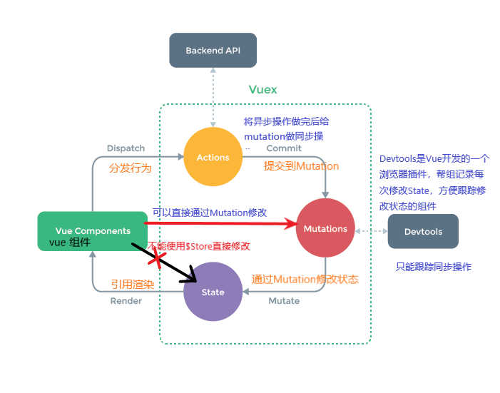

# vuex

+ 状态管理工具
+ vuex是专为Vue.js应用程序开发的**状态管理模式**
+ 它采用**集中式存储管理** 应用所有组件状态

## 状态管理

+ 多个组件都需要一个状态（变量等）来对自身的DOM进行调整
+ 如果用子父通信方式获取状态会很麻烦
+ 共享状态放在任何一个组件都不合适
+ 新建一个**管家对象**用来管理这些共享状态
+ 当组件需要一个共享状态时，找**管家对象**即可
+ 这中使用管家对象进行管理就是一种**状态管理模式**

## vue的状态管理工具

+ vuex就是官方发布的一种用于管理状态的工具
  + 它是响应式的（状态变换，和这个状态有关系组件发送相应变化）
  + 多个组件共享状态时方便使用
  + 一般情况下的组件共享状态
    + 用户的登录状态
      + 请求时携带token
      + 用户登录完后服务器返回的token可以保存在vuex中
      + 那么多个组件都是需要token的，存储它是必要的
    + 地理位置信息
    + 商品的收藏，购物车物品

## 单页面状态管理

### State => View => Actions => State

+ 状态被引用（使用mustache等）到视图
+ 视图会绑定一些行为（如点击事件）
+ 行为发生后影响状态
+ 状态变化后循环上述机制


+ 这种是单页面状态管理，只在一个页面（组件）中进行状态视图行为的循环响应


## 多界面状态管理

+ vuex为全局单例模式
+ 将共享状态抽离给vuex实例进行存储
+ 按照vuex规定好的方式进行修改访问



+ 需要通过Action处理异步操作
+ 然后提交到mutation处理同步操作
+ 修改状态不能使用$store直接修改
+ 因为需要对DevTools进行跟踪

## Vuex的核心

+ ### State

  + State单一状态树 ：Single Source of Truth
  + 只有一个store来维护所有状态
  + 方便维护和管理

+ ### Getters

  + 获取state中的状态数据后，需要对其进行变化
  + 使用getters返回给组件处理过的数据
  + 这给options和computed很像
  + 必要性
    + 多个组件都需要的过滤状态数据
    + 在每个组件中都定义计算属性过于麻烦
    + 直接在状态管理实例中定义相应的getters

+ ### Mutation

  + 更新store状态唯一方式

  + 包含两个部分

    + 事件类型
    + 回调函数（第一个参数就是state)

  + 通过commit更新（传入事件类型）

  + ##### Mutation的响应规则（和data里的数据一样）

    + state中的数据改变，组件中有共享状态的也会改变

      + 响应式的内部原理（响应式系统）
      + state中的每个数据对象对应Dep（观察者模式）
      + 每个Dep对应一个[Watcher, Watcher,……]数组
      + Watcher数组对应每个使用了该状态的组件watcher

    + state中的数据能够响应式的要求

      + 数据提前定义好（对象数据都会被加入到响应式系统）

      + 在后来添加的属性（如在对象中新增属性，数据增加）不会加入到响应式系统

      + 原因：因为新加入的属性没有Dep和Watcher不属于监听范围（但是属性是存在的）

      + ##### vue最新版本无此限制，新加入的属性也是响应式的

        + 新版本delete 、object['new'] = 'new'都是可用的 

+ ### Actions

  + 当在处理状态数据时有异步操作
  + 在Actions中完成异步操作，再使用Mutations
  + 在组件中使用dispatch传入action异步事件类型
  + 然后再actions中完成异步操作（可以给组件回执）
  + 最后在action中提交commit同步操作给mutation执行

+ ### modules

  + 在当store比较臃肿的时候，允许将store分割成模块
  
  + 每个模块与一个store的功能类似（但仍然只有一个store）
  
  + 一个模块可以有自己的mutations, state, actions,gettters,modules(一般没有)
  
  + 可以在外部进行对象抽离定义，然后放入模块中
  
  + 使用**模块中的状态数据**只需要this.$store.state.moduleA.data
  
  + 使用**mutations**中的方法时，和一般情况一致，因为模块中的都“合成”到了store中
  
  + 使用和定义**getters**中的数据，和一般情况一致，但要使用父状态数据需要传入rootState
  
  + 使用**actions**中的数据，context用法不变，但是context包含state，rootState，getters等
  
    + 可以把context替换为{state, rootState, commit} (对象的结构)
  
    + 对象的结构
  
    + ```js
      const context = {
          commit: 1,
          rootState: 2,
          state: 3,
          getters: 4,
          dispatch: 5,
          rootGetters: 6
      }
      
      const {commit, rootState, state} = context;
      // 然后就可以直接使用commit rootState state 避免了一个个取出来的重复操作
      ```
  
      

## store文件夹目录

+ ##### 为了避免状态管理仓库过大

  + 将state数据抽离在store声明外部
  + 将moudle模块抽离在store声明外部